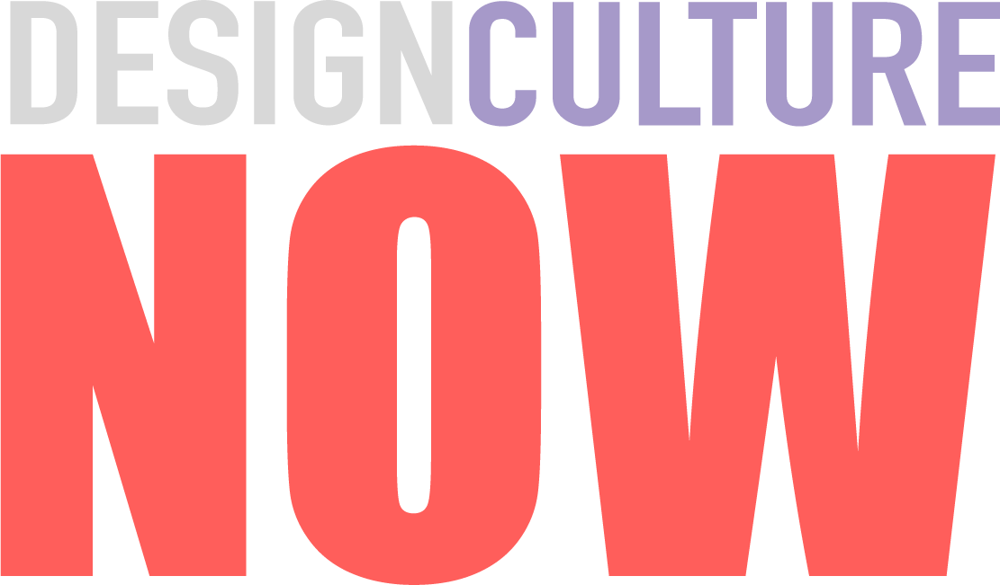
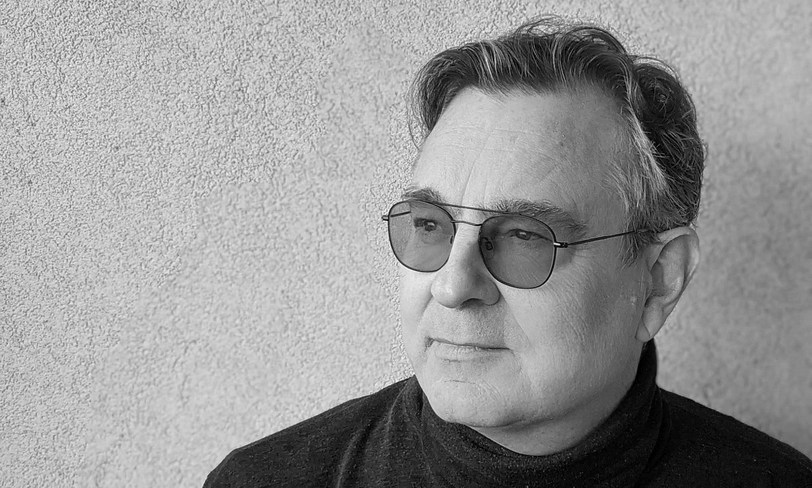
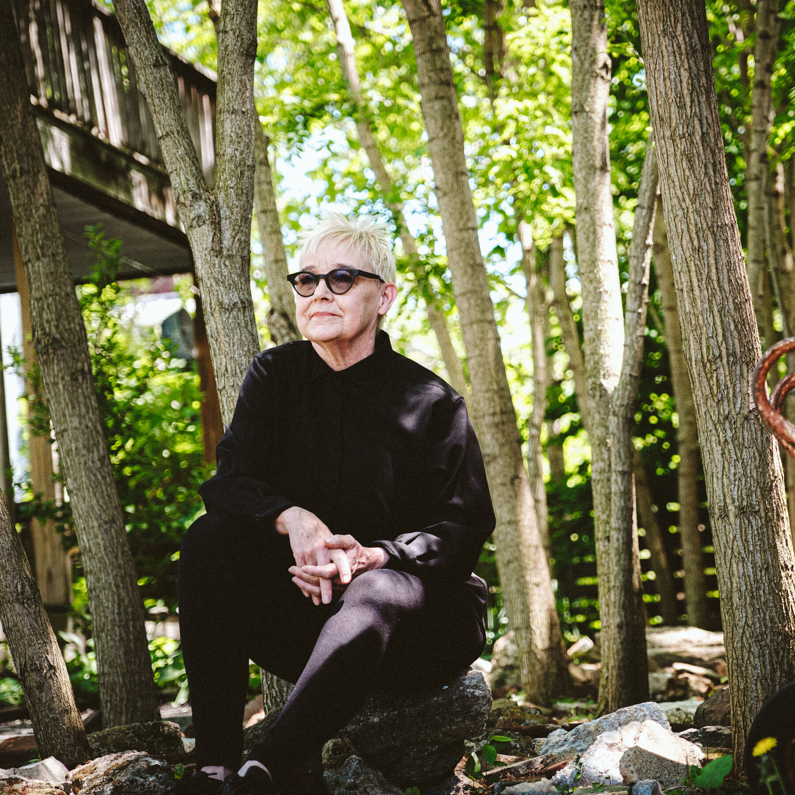
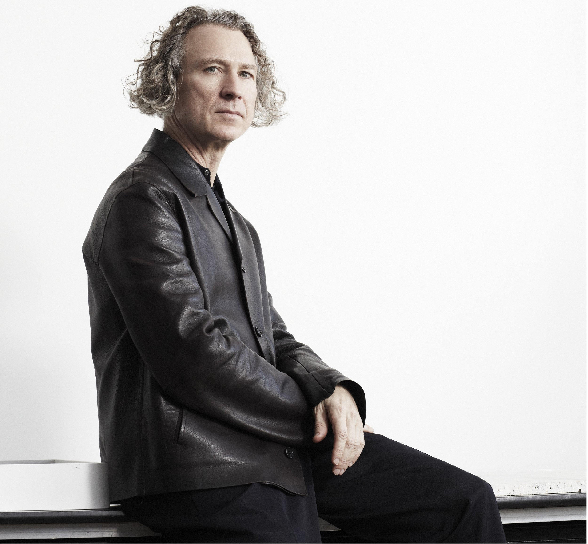
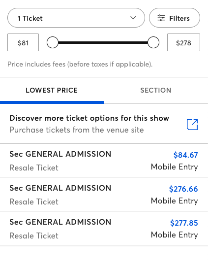
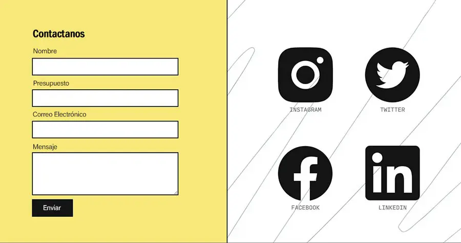
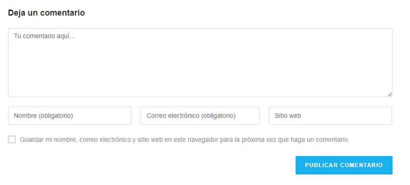

<!DOCTYPE html>
<html lang="en">

<head>

    <meta charset="UTF-8">
    <meta name="viewport" content="width=device-width, initial-scale=1.0">
    <title>Document</title>

    <link rel="stylesheet" href="CSS/estilo.css">

    <link rel="preconnect" href="https://fonts.googleapis.com">
    <link rel="preconnect" href="https://fonts.gstatic.com" crossorigin>
    <link
        href="https://fonts.googleapis.com/css2?family=Inter:ital,opsz,wght@0,14..32,100..900;1,14..32,100..900&display=swap"
        rel="stylesheet">
</head>

<body>
    <main>
        <header>
            
        </header>
        <nav>
            <a href="#erik">Erik Adigard</a>
            <a href="#julie">Julie Bargmann</a>
            <a href="#michael">Michael Gabellini</a>
            <a href="#rebeca">Rebeca Méndez</a>
            <a href="#mapa">Ubicación</a>
            <a href="#boletos">Boletos</a>
        </nav>
        <section>
            

                

                

                    <h2 id="erik">Erik Adigard.</h2>
                    

                        Erik Adigard | M.A.D.  
                        Thursday, September 12  
                        6:00 pm  
                        Graphic designer Erik Adigard founded McShaneAdigard Design (M.A.D.) in 1989. The firm has
                        sincedesigned Web sites, multimedia installations, andprint publications for global clients,
                        including Wiredmagazine.
                    

                

            

            

                

                

                    <h2 id="julie">Julie Bargmann</h2>
                    

                        Julie Bargmann | D.I.R.T.  
                        StudioTuesday, October 9  
                        7:30 pm  
                        Julie Bargmann founded D.I.R.T Studio, a landscapeconsultancy, in 1992. Recent projects
                        includethe landscaping of the Massachusetts Museum ofContemporary Art in North Adams, and
                        Riverside ParkSouth and the Hudson River Park in New York City.
                    

                

            

            

                

                

                    <h2 id="michael">Michael Gabellini.</h2>
                    

                        Michael Gabellini | Gabellini Associates  
                        Wednesday, November 2  
                        6:00 pm  
                        Michael Gabellini, a graduate of the Rhode IslandSchool of Design, worked for Kohn
                        Pedersen FoxAssociates before founding his own practice in 1991.Recent projects include
                        exhibitions for the GuggenheimMuseum, the Marian Goodman Gallery, and theCouncil of
                        Fashion Designers of America.
                    

                

            

            

                

                

                    <h2 id="rebeca">Rebeca Méndez.</h2>
                    

                        Rebeca Méndez | Méndez Communications  
                        Thursday, December 4  
                        6:30 pm  
                        Rebeca Méndez, born and raised in Mexico Cityand trained at the Art Center College of Design
                        inPasadena, has designed publications for the GettyCenter, the Los Angeles County Museum of Art,
                        andthe Whitney Museum of American Art.
                    

                

            

            

                

                    <iframe
                        src="https://www.google.com/maps/embed?pb=!1m18!1m12!1m3!1d3020.982640011025!2d-73.9578732!3d40.7843958!2m3!1f0!2f0!3f0!3m2!1i1024!2i768!4f13.1!3m3!1m2!1s0x89c258a2492a3fb1%3A0x2028546238b46dfa!2sMuseo%20Nacional%20de%20Dise%C3%B1o%20Cooper-Hewitt!5e0!3m2!1ses-419!2smx!4v1725905247336!5m2!1ses-419!2smx"
                        width="350" height="350" style="border:0;" allowfullscreen="" loading="lazy"
                        referrerpolicy="no-referrer-when-downgrade"></iframe>
                

                

                    <h2 id="mapa">Ubicación.</h2>
                    
Cooper-Hewitt, National Design Museum  
                        2 East 91st Street  
                        New York City

                

            

            

                

                

                    <h2 id="boletos">
                        
Adquiere tus boletos.

                    </h2>
                

            

        </section>
        <footer>
            

                
 

            

        </footer>
    </main>
</body>

</html>
